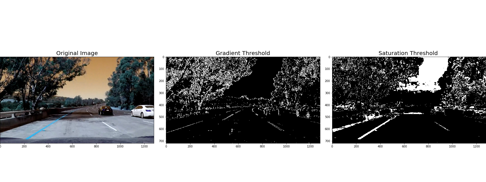
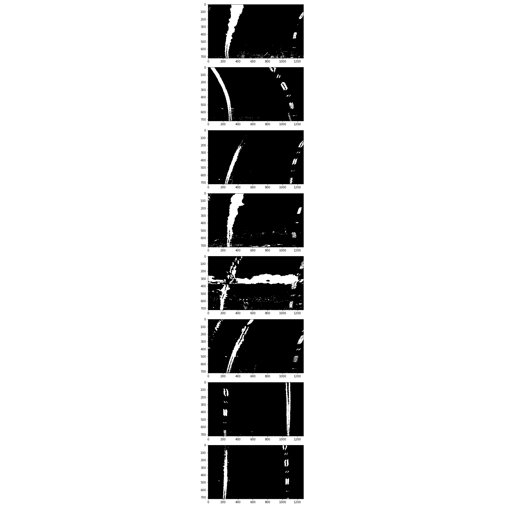
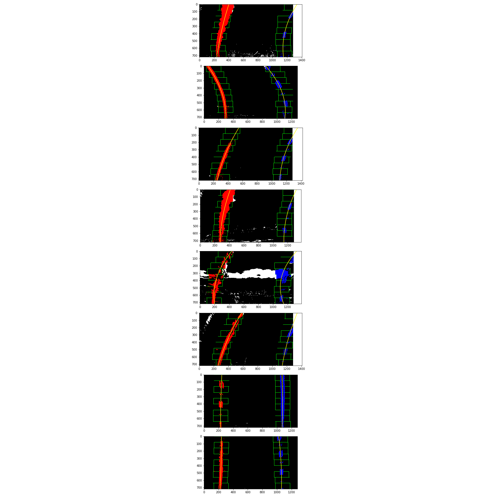
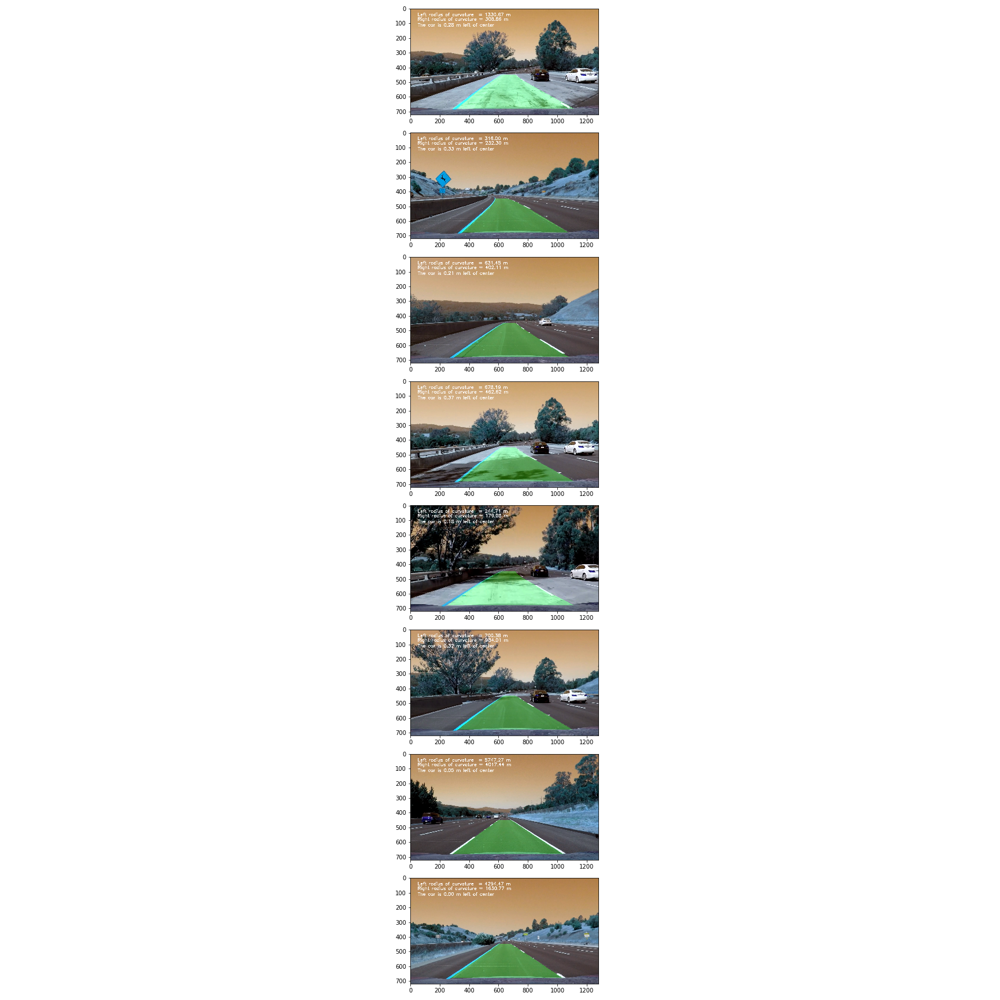

# Advanced Lane Lines

The main goal of this project is to detect the lane lines on the road from a video feed, in order to do that we will do the following :

* Compute the camera calibration matrix and distortion coefficients given a set of chessboard images.
* Apply a distortion correction to raw images.
* Use color transforms and gradients to create a thresholded binary image.
* Apply a perspective transform to rectify binary image ("birds-eye view").
* Detect lane pixels and fit to find the lane boundary.
* Determine the curvature of the lane and vehicle position with respect to center.
* Warp the detected lane boundaries back onto the original image.
* Output visual display of the lane boundaries and numerical estimation of lane curvature and vehicle position.

# Camera calibration

Every camera has it's own flaws, the result is a distortion of the output. The purpose of this step is to detect this distortion and correct it so it does not affect the following process of detecting the lane lines.

In [2], chessboard images are used because they highly contrasted and also because of the regular shapes of the squares which makes the automatic detection of the squares corners easy. The OpenCV function **cv2.findChessboardCorners** automatically detects the corners, feeding them to **cv2.calibrateCamera** in [3] gives us the distortion matrix and calibration coefficients.

The **cv2.undistort** function is used to undistort the images using the previously calculated coefficients

# Lane Detection Pipeline

This pipeline is used to process the images providing as an output the original images with visual display of the lanes and numerical estimation of lane curvature and car position. The pipeline follows these steps :
* Image undistortion (discussed above)
* Bird eye view transform
* Creating the binary images
* Detecting the lanes pixels, polynomial fit, lane curvature and car position
* Visual display of the results

### Perspective Transform

In order to clearly detect the lane lines and to correctly measure the lane curvature, a transformation of the image from the car front view to a top down view of the road makes things a lot easier. In [9] a **Bird View** function is implemented. First, four points of the image are chosen and stored in **src** array. Next, we choose where we want these four points to be after the transform, we store the new points in **dst** array. 

The choice of **src** and **dst** points is very important as we don't want the image to be distorted after transformation. The image with straight lane lines is chosen for this step in order to make the choice of **dst** points easier. The resulting image must have vertical lines in this case.

The perspective transform can also be used as a ** region of interest** function, a good choice of **dst** point (as close as possible to the edge of the image but still cover all the lane lines) will ommit the rest of the image and keep only the region that most likely contain pixels of the lane lines.

### Binary images

In [6] and [7] the RGB colored images are transformed to binary images using thresholding techniques of gradient and saturation. The gradient threshold is used a basic technique and saturation threshold is added to improve the yellow line detection and the overall detection in situation of shadow and road color change.  

The combination of saturation and gradient thresholding is chosen after testing many other combinations, this one seemed to give the best result. The following images shows the result after a perspective transform.

### Lane lines detection

For this part, a sliding window technique is used to detect the pixels that are part of the lane lines.

In [13], the peaks of the histogram of the bottom of image helps detect the position of the lanes lines. After that, the algorithm goes vertically through the images and slides the window left and right to correct the postition of the lane line center. A polynomial fit is then used to extrapolate the lanes pixels. The following images are a visualisation of the process.

### Radius of curvature & position of the car

In the same function [13] , the polynomial fit is used to calculate the radius of curvature using the formula detailed in this [tutorial](https://www.intmath.com/applications-differentiation/8-radius-curvature.php "Radius of curvature tutorial"). The car deviation from the center of the lane is calculated by deviding the center of the image from the center of the lane lines. If the result is positive, then the car is left of the center otherwise it's on the right of the center.

### Visual display

In [16], the complete pipeline is implemented, the input is the raw images. The image is passed through all the previously mentioned processes. The last part of the pipeline uses the **cv2.fillPoly** function to draw the lane and the function **cv2.putText** to write the curvature radius and car position on the images.

### Video pipeline

The video is passed image by image through the same pipeline that we discussed above. You can watch the video [here](video_output.mp4 "Output video")  (vide also available in the repository as video_output.mp4)

# Discussion

The hardest part of this project was the transformation from original images to binary images where the lane lines are distinguishable from the rest of the pixels. This part was more of trial and error until I found the best combination in this case (gradient + saturation threshold). This comes also with the difficulty of fine tuning the parameters. These methods even though gave great results with the project video, they are not very robust in many cases. As we can see in the challenge video, the change of light intensity, the overtaking cars, the sun relexion on the camera lenses all result in a failure of correctly detecting the lane lines. 

A way of making the algorithm more robust is by replacing the saturation threshold by another technique that is less sensitive to the light intensity but still detects the yellow line.

Another way of improving this project would be to use weights for the line pixels. Giving higher weights to the closer pixels to the car will avoid failure of detection when there is another car in the field of view or when there is a hard turn.
